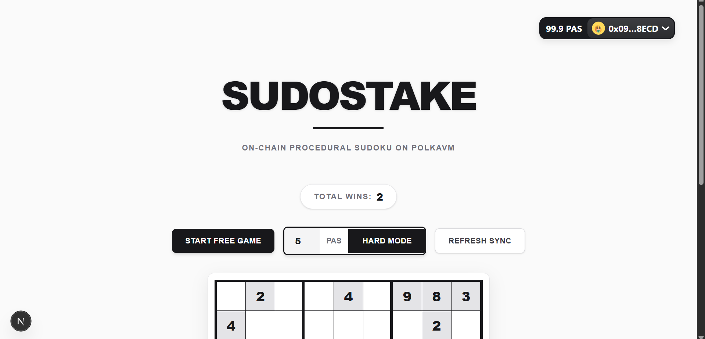
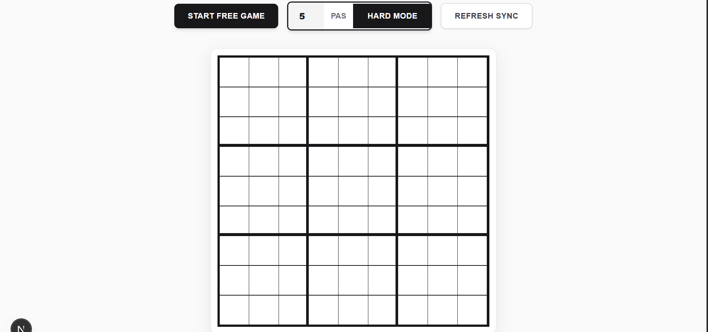
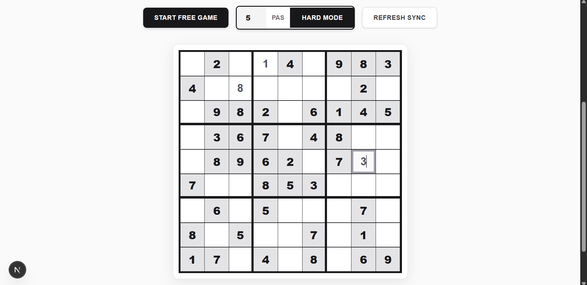
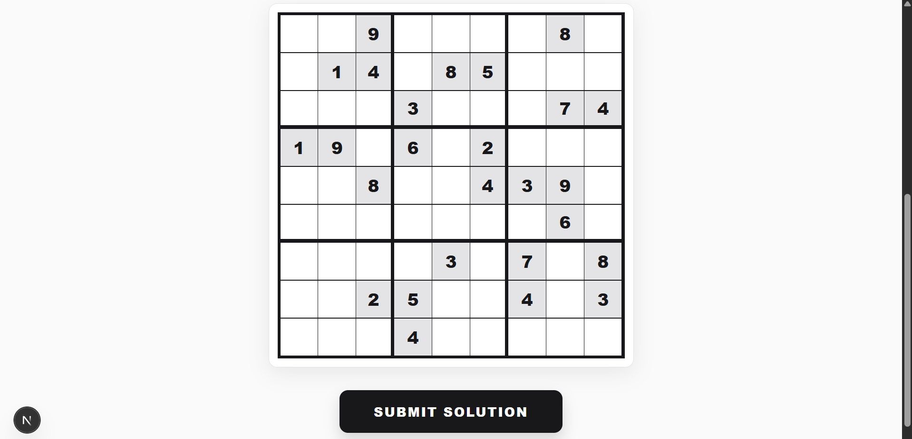

# 🎲 SudoStake

> The first fully on-chain, procedurally generated Sudoku platform on **Polkadot Hub**


---

## 🚀 Overview

SudoStake is a **fully on-chain decentralized gaming protocol** that combines:

* 🎲 Procedural Sudoku generation
* 🧠 On-chain mathematical validation
* 💰 Token-based incentive mechanics

Built on **Polkadot Hub**, it leverages a **dual-VM architecture (EVM + PVM)**:

* **EVM (Solidity)** → Handles staking, payouts, and game state
* **PVM (Rust / RISC-V)** → Handles puzzle generation & validation

> 🔥 Result: A trustless, gas-efficient, oracle-free gaming system.

---

## ✨ Key Features

| Feature                  | Description                               | Layer    |
| ------------------------ | ----------------------------------------- | -------- |
| 🎮 Free & Hard Modes     | Play casually or stake tokens for rewards | EVM      |
| 🎲 Infinite Boards       | Procedural generation ensures uniqueness  | PVM      |
| 🛡️ Trustless Validation | Enforces all Sudoku rules on-chain        | PVM      |
| ⚡ Gas Optimized          | Bitmask algorithm replaces nested loops   | PVM      |
| 💰 Secure Treasury       | Handles staking, payouts & slashing       | EVM      |
| 🎨 Smooth UX             | Instant UI updates with Web3 hooks        | Frontend |

---

## 🏗️ Architecture Overview

SudoStake uses **cross-VM execution** enabled by Polkadot Hub.

```
┌───────────────────────────────────────────────┐
│              Frontend (Next.js)               │
│     Wagmi │ Viem │ RainbowKit │ Tailwind      │
└──────────────────────┬────────────────────────┘
                       │
          ┌────────────┴────────────┐
          │                         │
┌─────────▼───────────┐   ┌─────────▼───────────┐
│    EVM Contracts    │   │   PVM Game Engine   │
│     (Solidity)      │◄─►│   (Rust / RISC-V)   │
│                     │   │                     │
│ • Staking Logic     │   │ • Generator         │
│ • Session State     │   │ • Validator         │
│ • Treasury          │   │ • RNG Engine        │
└─────────────────────┘   └─────────────────────┘
```

---

## 🌊 Execution Flow

### System Flow

```
User → Frontend → EVM → PVM → Validation → Result
```

### Game Lifecycle

```
Player → Start Game → Stake Tokens
        ↓
EVM → Generate Seed
        ↓
PVM → Generate Sudoku Board
        ↓
Frontend → Render Grid
        ↓
Player → Submit Solution
        ↓
EVM → Calls PVM Validator
        ↓
✔ Valid → Reward Player
✖ Invalid → Slash Stake
```

---

## 🧮 Algorithm & Smart Contract Mathematics

To achieve **gas efficiency**, SudoStake uses a **bitmask-based validation algorithm**.

For each value $v \in [1,9]$:

$$
mask = mask \mid (1 \ll v)
$$

A valid Sudoku group satisfies:

$$
2^1 + 2^2 + \dots + 2^9 = 1022
$$

Thus:

$$
\forall g \in Groups,\quad \sum_{i \in g} (1 \ll board[i]) = 1022
$$

➡️ Complexity improves from **O(n²)** → **O(n)**

---

## 🛠️ Tech Stack

### Smart Contracts

* Solidity `0.8.24`
* OpenZeppelin (Security primitives)
* Rust (`#![no_std]`)
* RISC-V (PolkaVM execution)

### Frontend

* Next.js 16 (App Router)
* React 18
* Tailwind CSS

### Web3

* Wagmi
* Viem
* RainbowKit

---

## 📂 Project Structure

```
SudoStake/
├── assets/
│   ├── dashboard.png
│   ├── easy.png
│   ├── idle.png
│   └── hard.png
├── contracts/
│   ├── SudoStake.sol
├── rust/
│   └── pvm-contract/
│       ├── src/main.rs
└── frontend/
    ├── app/
    ├── components/
    │   └── GameBoard.jsx
    └── utils/
        └── contract.js
```

---

## 🚀 Installation

```bash
git clone https://github.com/Kaustubh-1-7/sudokuStake.git
cd SudoStake
```

```bash
cd frontend
npm install
npm run dev
```

```bash
cd rust/pvm-contract
rustup override set nightly
cargo install polkatool --version 0.26.0
make
```

---

## 📸 Screenshots

### 🏠 Dashboard
Displays total wins, wallet connection status, and game modes (Easy / Hard / Refresh)



### ⏸️ Idle State
Board before starting a game



### 🎮 Easy Mode
Interactive Sudoku grid with more hints for easier solving



### 🔥 Hard Mode
Challenging Sudoku board with fewer hints



---

> 💡 Tip: Reload the app if any network/UI issue occurs.

---

## 🤝 Contributing

* Fork the repo
* Create branch
* Commit changes
* Push
* Open PR 🚀

---

## 📜 License

MIT License © 2026
